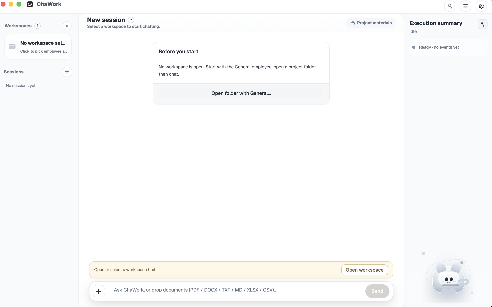

<div align="center">
  <h1>ChaWork</h1>
  <p><strong>Open-source desktop workbench for local AI employees, reviewable work, and reusable team knowledge.</strong></p>
  <p>
    <a href="https://chavoai.cn/">Website</a> ·
    <a href="README.zh-CN.md">中文</a> ·
    <a href="CONTRIBUTING.md">Contributing</a> ·
    <a href="https://github.com/chaworkAI/chawork-runtime">Runtime</a> ·
    <a href="https://github.com/openai/codex">OpenAI Codex</a>
  </p>
  <p>
    
    
    
    
  </p>
  
</div>

## What Is ChaWork?

ChaWork is an open-source desktop app for turning repeated knowledge work into AI employee workflows that can be inspected, reused, and improved over time.

ChaWork works with local project folders. You bring an OpenAI-compatible model provider, open a workspace, bind an employee, run real tasks, review the execution trail, and turn useful lessons into future working methods. The agent execution layer is provided by `chawork-runtime`, a ChaWork-maintained runtime facade built on the open-source [OpenAI Codex](https://github.com/openai/codex) project.

ChaWork is independently maintained. It is not a hosted SaaS, not an official OpenAI product, and not a thin chat wrapper. It is a local-first workbench for project context, employee prompts, skills, sessions, file changes, review queues, and Dream-based prompt improvement.

## Why It Exists

Most AI work starts as a chat and then disappears into history. ChaWork is built for teams that want useful work to become a repeatable practice:

- Keep project context attached to real local folders.
- Give recurring work a named employee with a stable prompt and skills.
- See what the runtime did before accepting file changes or prompt updates.
- Let reviewed sessions improve the employee through an explicit approval flow.
- Keep the product layer independent from raw Codex protocol details.

## Core Concepts

| Concept | Meaning |
| --- | --- |
| Workspace | A local folder ChaWork can work in. Sessions, knowledge, runtime config, and workspace state are scoped to it. |
| Employee | A reusable role with a prompt, skills, workspace bindings, and Dream settings. |
| Session | A conversation and execution history inside one workspace. Sessions share workspace files but keep separate transcripts. |
| Review Queue | The place where file changes, approvals, and Dream prompt updates wait for user review. |
| Dream | ChaWork's learning loop. It analyzes selected recent sessions and proposes employee prompt updates that apply only after approval. |
| Runtime | The local sidecar that maps ChaWork requests to Codex execution and emits normalized events. |
| Provider | A user-managed OpenAI-compatible base URL, model, and API key. |

## Product Loop

```text
Open or add a workspace
  -> bind an employee
  -> create a session
  -> run a real task
  -> inspect runtime events and proposed changes
  -> approve, reject, or edit review items
  -> let Dream propose employee improvements from useful sessions
```

## Features

- **Local-first workspaces**: work with user-selected folders and keep workspace state on the local machine.
- **Employee-centered workflow**: create employees with prompts and skills, then bind them to the folders where they should work.
- **Project materials**: import and search local documents such as PDF, DOCX, TXT, Markdown, XLSX, and CSV files.
- **Runtime inspector**: watch tool calls, file activity, knowledge retrieval, MCP activity, errors, and lifecycle events as a task runs.
- **Review before acceptance**: keep user approval in the loop for meaningful changes and Dream prompt updates.
- **Dream improvement loop**: analyze recent sessions and generate prompt update proposals for the selected employee.
- **OpenAI-compatible providers**: configure a base URL, model, and API key without hard-coding a provider into the repository.
- **Codex-based runtime boundary**: use [OpenAI Codex](https://github.com/openai/codex) through the stable `chawork-runtime` contract instead of coupling product state to raw Codex events.

## Quick Start

### Prerequisites

- Node.js 22+.
- pnpm 10.32+.
- Rust stable, installed with `rustup`.
- Native Tauri prerequisites for macOS or Windows.
- Optional import tools: `pandoc`, `ffmpeg`, `whisper-cli`, and `tesseract`.

On macOS, optional import tools can be installed with:

```bash
brew install pandoc ffmpeg whisper-cpp tesseract tesseract-lang
```

### Run from Source

Clone with submodules:

```bash
git clone --recurse-submodules https://github.com/chaworkAI/chawork.git
cd chawork
```

If you already cloned without submodules:

```bash
git submodule update --init --recursive
```

Install dependencies and start the desktop app:

```bash
pnpm install
pnpm run tauri:dev
```

`pnpm run tauri:dev` builds the required runtime sidecars, starts the Vite dev server, and launches the Tauri desktop app.

### First Run

1. Open **Settings -> Provider** and configure an OpenAI-compatible base URL, API key, and model.
2. Open or add a local project folder as a workspace.
3. Bind the built-in General employee or create your own employee.
4. Create a session and send a task.
5. Use the runtime inspector and review queue to inspect what happened.

## Common Commands

| Task | Command |
| --- | --- |
| Start desktop development mode | `pnpm run tauri:dev` |
| Build frontend | `pnpm build` |
| Build all runtime sidecars | `pnpm run build:runtime` |
| Build Codex CLI sidecar | `pnpm run build:codex-cli` |
| Build ChaWork runtime sidecar | `pnpm run build:chawork-runtime` |
| Build workspace MCP sidecar | `pnpm run build:mcp` |
| Check backend binaries | `cargo check --manifest-path backend/Cargo.toml --bins --locked` |
| Test backend | `cargo test --manifest-path backend/Cargo.toml --locked` |
| Check runtime facade | `cargo check --manifest-path chawork-runtime/codex-rs/Cargo.toml -p chawork-runtime` |
| Test runtime facade | `cargo test --manifest-path chawork-runtime/codex-rs/Cargo.toml -p chawork-runtime` |

## Repository Layout

```text
.
├── backend/           # Rust backend, Tauri app, product services, and chawork-mcp-server
├── frontend/          # Vite + React desktop UI
├── src-tauri/         # symlink to backend/ for Tauri CLI compatibility
├── chawork-runtime/   # public Git submodule: chaworkAI/chawork-runtime
├── assets/            # README and brand assets
└── scripts/           # helper scripts for sidecars, smoke checks, and packaging
```

Public onboarding lives in this README, [README.zh-CN.md](README.zh-CN.md), and [CONTRIBUTING.md](CONTRIBUTING.md). Keep the English and Chinese README files structurally aligned when changing public documentation.

## Architecture

ChaWork separates product state from the execution engine:

| Layer | Responsibility |
| --- | --- |
| Frontend | React UI for chat, workspaces, sessions, project materials, runtime events, review queues, employees, Dream, and settings. |
| Backend | Rust/Tauri commands, local persistence, workspace and employee services, provider configuration, runtime process management, and transcript/review state. |
| `chawork-runtime` | Stable ChaWork runtime contract, capability matrix, event mapping, audit events, raw-policy handling, and Dream execution contract. |
| [OpenAI Codex](https://github.com/openai/codex) | Agent loop, thread/turn/item lifecycle, tools, MCP, skills, approvals, sandbox behavior, and resume semantics. |

Product behavior should be driven by the stable `chawork-runtime` contract. Raw Codex payloads are useful for debugging and inspector views, but they should not become the source of truth for transcript state, busy state, review queues, Dream state, or persistence decisions.

## Runtime Sidecars

ChaWork builds and uses repository-local sidecars:

- `chawork-runtime/codex-rs/target/{debug,release}/chawork-runtime`
- `chawork-runtime/codex-rs/target/{debug,release}/codex`
- `backend/target/{debug,release}/chawork-mcp-server`

The desktop app does not search for a global `codex` on `PATH` and does not read or modify the user's global Codex configuration. Runtime state is prepared in a scoped `CODEX_HOME` for the active workspace or Dream run.

Runtime source and attribution:

- ChaWork runtime submodule: [chaworkAI/chawork-runtime](https://github.com/chaworkAI/chawork-runtime).
- The [OpenAI Codex](https://github.com/openai/codex) revision used by the current runtime release unit is recorded in `chawork-runtime/codex-rs/chawork-runtime/src/capability_matrix.rs` and the runtime README.
- ChaWork Runtime preserves the relevant upstream license and notice files for code derived from [OpenAI Codex](https://github.com/openai/codex).

## Data and Network Boundaries

ChaWork is local-first, but model requests are sent to the provider you configure.

- You provide the OpenAI-compatible base URL, model, and API key.
- Provider credentials are stored locally in ChaWork provider configuration.
- Runtime child processes receive provider credentials through environment variables.
- Provider credentials should not appear in commits, workspace files, frontend payloads, or normal logs.
- Workspace state, sessions, employee prompts, Dream results, indexes, and logs are stored locally.
- Dream reads the target employee prompt snapshot and selected recent session snapshots.
- Released desktop builds may check `https://api.chawork.com` for updates. Source development builds can be run without a private runtime token.

## Packaging Notes

The repository supports source builds and local development builds. Installer signing, updater metadata, and release channels are handled at release time. Unsigned local builds may trigger macOS Gatekeeper or Windows SmartScreen warnings.

macOS and Windows sidecar preparation scripts live in [scripts/](scripts/). Use the current release notes for platform-specific signing or installer expectations.

## Contributing

Read [CONTRIBUTING.md](CONTRIBUTING.md) before opening a pull request.

Good ChaWork PRs usually include:

- What changed and why.
- Which layer owns the change: frontend, backend, runtime facade, Codex upstream area, Employee, Workspace, Dream, packaging, or docs.
- The checks you ran.
- Screenshots or recordings for visible UI changes.
- Runtime boundary notes when touching contract, mapper, raw policy, audit, lifecycle, provider/security policy, Dream, or session persistence.

Keep unrelated cleanup separate from feature or bug-fix changes.

## Security Reports

Report security-sensitive issues through GitHub private vulnerability reporting when it is enabled on the repository. If it is not enabled, contact the maintainers through a private channel provided by the repository owner.

ChaWork-specific issues should be reported to ChaWork maintainers rather than OpenAI security programs unless the issue also affects upstream OpenAI software or services.

Please do not open public issues for active vulnerabilities, leaked credentials, or exploitable security problems.

## License and Attribution

ChaWork is licensed under the [Apache License 2.0](LICENSE).

ChaWork Runtime includes code derived from the open-source [OpenAI Codex](https://github.com/openai/codex) project and preserves the upstream license and notices in the runtime repository. See [NOTICE](NOTICE) for attribution.

## Acknowledgements

ChaWork builds on [OpenAI Codex](https://github.com/openai/codex) as its runtime foundation. We keep Codex references inside the bundled runtime source, package metadata, tests, and protocol code where they describe upstream behavior or preserve compatibility, and we acknowledge the Codex project and its contributors in [NOTICE](NOTICE).
