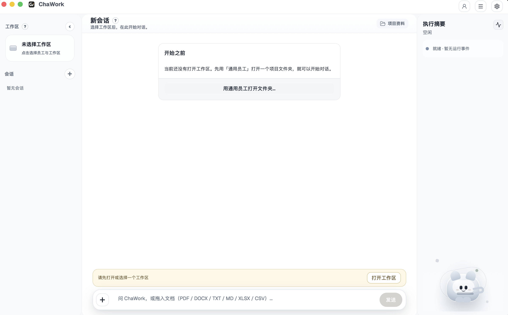

<div align="center">
  <h1>ChaWork</h1>
  <p><strong>开源桌面工作台：让本地 AI 员工完成可审查、可复用、可持续改进的知识工作。</strong></p>
  <p>
    <a href="https://chavoai.cn/">项目官网</a> ·
    <a href="README.md">English</a> ·
    <a href="CONTRIBUTING.md">贡献指南</a> ·
    <a href="https://github.com/chaworkAI/chawork-runtime">运行时项目</a> ·
    <a href="https://github.com/openai/codex">OpenAI Codex</a>
  </p>
  <p>
    
    
    
    
  </p>
  
</div>

## ChaWork 是什么？

ChaWork 是一个开源桌面应用，目标是把反复发生的知识工作沉淀成可审查、可复用、可持续改进的 AI 员工工作流。

ChaWork 围绕本地项目文件夹工作。你提供 OpenAI 兼容的模型服务，打开工作区，绑定员工角色，运行真实任务，审查执行痕迹，并把有价值的经验沉淀为后续工作方法。智能体执行层由 `chawork-runtime` 提供；它是 ChaWork 维护的运行时封装，基于 OpenAI 开源项目 [OpenAI Codex](https://github.com/openai/codex) 构建。

ChaWork 由 ChaWork 独立维护，不是托管式 SaaS，不是 OpenAI 官方产品，也不是一个薄薄的聊天外壳。它更像本地优先的工作台，用来管理项目上下文、员工提示词、技能、会话、文件变化、审查队列，以及基于 Dream 的提示词改进流程。

## 为什么做它

很多 AI 协作从一次聊天开始，也止步于聊天记录。ChaWork 面向的是希望把有效协作变成稳定方法的个人和团队：

- 把项目上下文绑定到真实的本地文件夹。
- 为重复工作创建有名字、有提示词、有技能的员工角色。
- 在接受文件变化或提示词更新前，看清运行时做了什么。
- 让经过审查的会话反哺员工能力，但所有改进都经过显式批准。
- 让产品状态与 Codex 原始协议细节保持清晰边界。

## 核心概念

| 概念 | 含义 |
| --- | --- |
| Workspace / 工作区 | ChaWork 可以操作的本地文件夹。会话、知识库、运行时配置和工作区状态都围绕它组织。 |
| Employee / 员工 | 可复用的角色，包含提示词、技能、绑定的工作区和 Dream 设置。 |
| Session / 会话 | 某个工作区内的一段对话和执行历史。多个会话共享工作区文件，但保留各自的聊天记录。 |
| Review Queue / 审查队列 | 文件变化、审批请求和 Dream 提示词更新等待用户确认的地方。 |
| Dream | ChaWork 的学习闭环。它分析选中的最近会话，提出员工提示词更新建议，只有用户批准后才会应用。 |
| Runtime / 运行时 | 本地伴随程序，负责把 ChaWork 请求映射到 Codex 执行，并输出规范化事件。 |
| Provider / 模型服务 | 用户自行配置的 OpenAI 兼容 API 地址、模型和 API key。 |

## 产品闭环

```text
打开或添加工作区
  -> 绑定员工
  -> 创建会话
  -> 运行真实任务
  -> 检查运行时事件和建议变更
  -> 批准、拒绝或编辑审查项
  -> 让 Dream 从有效会话中提出员工改进建议
```

## 功能亮点

- **本地优先的工作区**：围绕用户选择的本地文件夹工作，工作区状态保存在本机。
- **以员工为中心的工作流**：创建带提示词和技能的员工，再把员工绑定到适合它工作的文件夹。
- **项目资料管理**：导入并搜索 PDF、DOCX、TXT、Markdown、XLSX、CSV 等本地文档。
- **运行时检查器**：任务运行时可以查看工具调用、文件活动、知识检索、MCP 活动、错误和生命周期事件。
- **先审查再接受**：重要变更和 Dream 提示词更新都进入用户审查流程。
- **Dream 改进闭环**：分析最近会话，为选中的员工生成提示词更新建议。
- **OpenAI 兼容服务配置**：通过 API 地址、模型和 API key 连接模型服务，不把具体服务商写死在仓库里。
- **基于 Codex 的运行时边界**：产品层通过稳定的 `chawork-runtime` 协议使用 [OpenAI Codex](https://github.com/openai/codex)，而不是直接依赖 Codex 原始事件作为业务状态。

## 项目状态

ChaWork 正在积极开发中。桌面应用目前面向 macOS 和 Windows，不提供 Linux 桌面版。当前最推荐的试用方式是从源码运行。除非 GitHub release 明确说明已经提供签名安装包和正式发布通道，否则本地构建应视为开发构建。

## 快速开始

### 环境要求

- Node.js 22+。
- pnpm 10.32+。
- Rust stable，建议通过 `rustup` 安装。
- macOS 或 Windows 所需的 Tauri 原生依赖。
- 可选导入工具：`pandoc`、`ffmpeg`、`whisper-cli`、`tesseract`。

macOS 可用以下命令安装可选导入工具：

```bash
brew install pandoc ffmpeg whisper-cpp tesseract tesseract-lang
```

### 从源码运行

带子模块克隆仓库：

```bash
git clone --recurse-submodules https://github.com/chaworkAI/chawork.git
cd chawork
```

如果克隆时没有拉取子模块：

```bash
git submodule update --init --recursive
```

安装依赖并启动桌面应用：

```bash
pnpm install
pnpm run tauri:dev
```

`pnpm run tauri:dev` 会构建所需运行时伴随程序，启动 Vite 开发服务器，并打开 Tauri 桌面应用。

### 第一次使用

1. 打开 **Settings -> Provider**，配置 OpenAI 兼容的 API 地址、API key 和模型。
2. 打开或添加一个本地项目文件夹作为工作区。
3. 绑定内置 General 员工，或创建自己的员工角色。
4. 创建会话并发送任务。
5. 通过运行时检查器和审查队列查看执行过程与建议变更。

## 常用命令

| 任务 | 命令 |
| --- | --- |
| 启动桌面开发模式 | `pnpm run tauri:dev` |
| 构建前端 | `pnpm build` |
| 构建全部运行时伴随程序 | `pnpm run build:runtime` |
| 构建 Codex CLI 伴随程序 | `pnpm run build:codex-cli` |
| 构建 ChaWork Runtime 伴随程序 | `pnpm run build:chawork-runtime` |
| 构建工作区 MCP 伴随程序 | `pnpm run build:mcp` |
| 检查后端二进制 | `cargo check --manifest-path backend/Cargo.toml --bins --locked` |
| 运行后端测试 | `cargo test --manifest-path backend/Cargo.toml --locked` |
| 检查运行时封装 | `cargo check --manifest-path chawork-runtime/codex-rs/Cargo.toml -p chawork-runtime` |
| 运行运行时封装测试 | `cargo test --manifest-path chawork-runtime/codex-rs/Cargo.toml -p chawork-runtime` |

## 仓库结构

```text
.
├── backend/           # Rust 后端、Tauri 应用、产品服务和 chawork-mcp-server
├── frontend/          # Vite + React 桌面界面
├── src-tauri/         # 指向 backend/ 的符号链接，满足 Tauri CLI 约定
├── chawork-runtime/   # 公开 Git 子模块：chaworkAI/chawork-runtime
├── assets/            # README 和品牌展示资源
└── scripts/           # 伴随程序、冒烟检查和打包辅助脚本
```

公开上手文档由本 README、[README.md](README.md) 和 [CONTRIBUTING.md](CONTRIBUTING.md) 组成。修改公开 README 时，请保持中英文结构一致。

## 架构概览

ChaWork 把产品状态和执行引擎分开：

| 层 | 职责 |
| --- | --- |
| 前端 | React UI，负责聊天、工作区、会话、项目资料、运行时事件、审查队列、员工、Dream 和设置。 |
| 后端 | Rust/Tauri 命令、本地持久化、工作区和员工服务、模型服务配置、运行时进程管理、对话记录和审查状态。 |
| `chawork-runtime` | 稳定的 ChaWork 运行时协议、能力矩阵、事件映射、审计事件、原始请求策略和 Dream 执行协议。 |
| [OpenAI Codex](https://github.com/openai/codex) | 智能体循环、thread/turn/item 生命周期、工具、MCP、技能、审批、沙箱行为和恢复语义。 |

产品行为应由稳定的 `chawork-runtime` 协议驱动。Codex 原始载荷可以用于调试和检查器视图，但不应成为聊天记录状态、忙碌状态、审查队列、Dream 状态或持久化决策的数据源。

## 运行时伴随程序

ChaWork 构建并使用仓库内的本地伴随程序：

- `chawork-runtime/codex-rs/target/{debug,release}/chawork-runtime`
- `chawork-runtime/codex-rs/target/{debug,release}/codex`
- `backend/target/{debug,release}/chawork-mcp-server`

桌面应用不会搜索 PATH 上的全局 `codex`，也不会读取或修改用户的全局 Codex 配置。运行时状态会在当前工作区或 Dream 运行对应的作用域化 `CODEX_HOME` 中准备。

运行时来源与归属：

- ChaWork 运行时子模块：[chaworkAI/chawork-runtime](https://github.com/chaworkAI/chawork-runtime)。
- 当前运行时发布单元使用的 [OpenAI Codex](https://github.com/openai/codex) 源码版本记录在 `chawork-runtime/codex-rs/chawork-runtime/src/capability_matrix.rs` 和运行时 README 中。
- ChaWork Runtime 会为来自 [OpenAI Codex](https://github.com/openai/codex) 的代码保留相应的上游许可证和声明文件。

## 数据与网络边界

ChaWork 本地优先，但模型请求会发送到你配置的模型服务。

- 你自行提供 OpenAI 兼容的 API 地址、模型和 API key。
- 模型服务凭证保存在本地 ChaWork provider 配置中。
- 运行时子进程通过环境变量接收模型服务凭证。
- 模型服务凭证不应出现在提交、工作区文件、前端载荷或普通日志中。
- 工作区状态、会话、员工提示词、Dream 结果、索引和日志都保存在本机。
- Dream 读取目标员工提示词快照和选中的最近会话快照。
- 发布版桌面应用可能会访问 `https://api.chawork.com` 检查更新。从源码开发运行不需要私有运行时 token。

## 打包说明

仓库支持源码构建和本地开发构建。安装包签名、更新器元数据和发布通道属于正式发布流程。未签名的本地构建可能触发 macOS Gatekeeper 或 Windows SmartScreen 提示。

macOS 和 Windows 伴随程序准备脚本位于 [scripts/](scripts/)。平台签名和安装包预期以对应 release notes 为准。

## 参与贡献

提交 PR 前请先阅读 [CONTRIBUTING.md](CONTRIBUTING.md)。

好的 ChaWork PR 通常会说明：

- 改了什么，为什么改。
- 变更归属哪一层：前端、后端、运行时封装、Codex 上游区域、Employee、Workspace、Dream、打包或文档。
- 已运行的检查命令。
- 可见 UI 变化对应的截图或录屏。
- 如果触及 contract、mapper、raw policy、audit、lifecycle、provider/security policy、Dream 或 session persistence，需要说明运行时边界影响。

请把无关清理和功能/修复拆成不同 PR。

## 安全报告

安全敏感问题请优先通过 GitHub private vulnerability reporting（如果仓库已启用）报告；否则请使用仓库 owner 提供的私有渠道。

ChaWork 相关问题请报告给 ChaWork 维护者；除非问题也影响 OpenAI 上游软件或服务，否则不要提交到 OpenAI 安全项目。

请不要用公开 issue 披露活跃漏洞、泄露凭证或可利用的安全问题。

## 许可证与归属

ChaWork 使用 [Apache License 2.0](LICENSE)。

ChaWork Runtime 包含来自 OpenAI 开源项目 [OpenAI Codex](https://github.com/openai/codex) 的代码，并在运行时仓库中保留上游许可证和声明文件。归属信息见 [NOTICE](NOTICE)。

## 致谢

ChaWork 的运行时基础建立在 [OpenAI Codex](https://github.com/openai/codex) 的开源工作之上。我们会在引入的运行时源码、包元数据、测试和协议代码中保留用于说明上游行为或维持兼容性的 Codex 引用，并在 [NOTICE](NOTICE) 中保留归属说明。
